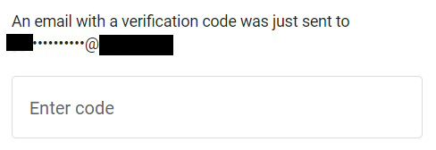
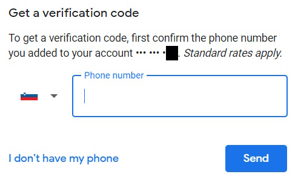

Let's go to <google.com/accounts/recovery> to see what is possible. Then we will know what settings to change in our Google account.  

Enter your email, next choose "Try another way". An email with a verification code will be sent to your "recovery email". The recovery email is not fully disclosed here. So only the person who entered it in settings really knows the recovery email address. The hacker will not understand what is the recovery email from this.

Continue pressing "Try another way". There you must already know what phone is set for "recovery phone".

If you enter the correct phone number, google will send a SMS text message with the verification code.

I have 
